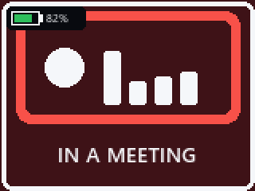
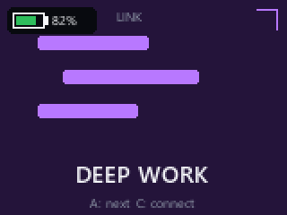
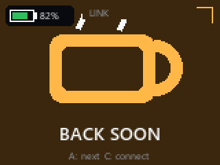
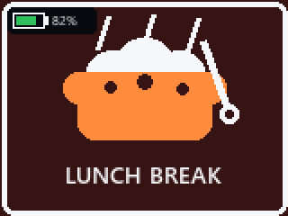
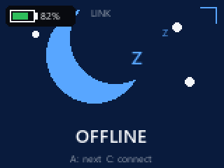
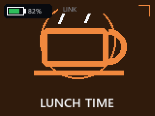
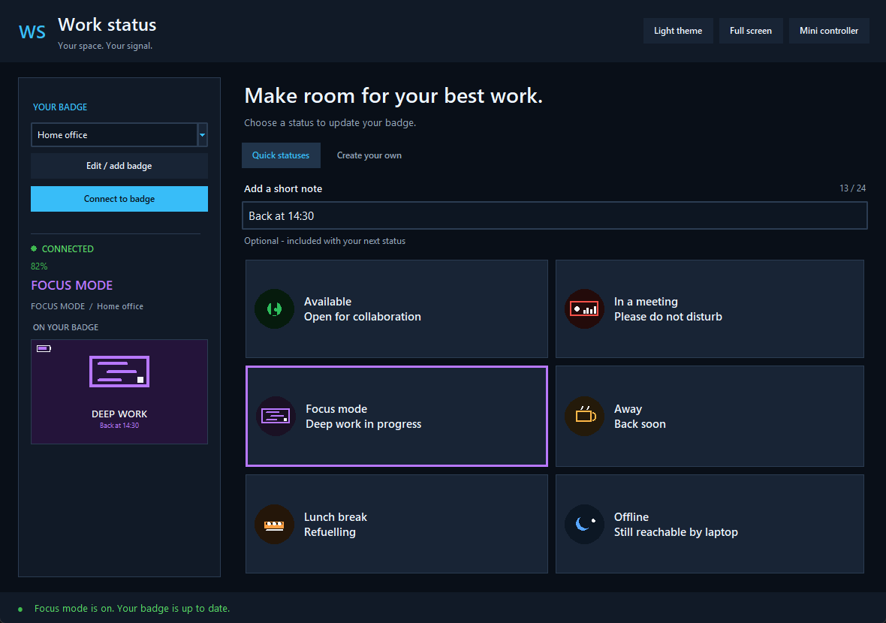
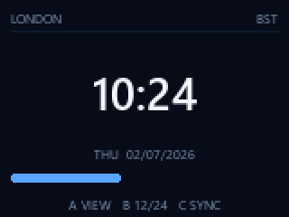
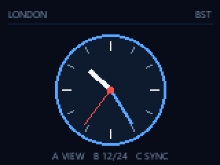
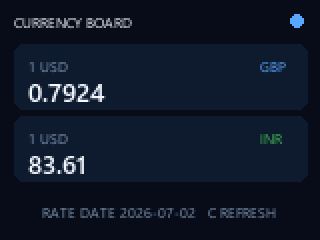

# GitHub Universe 2025 Badge Projects

Small, practical apps for the GitHub Universe 2025 badge: a location-aware
desk clock, a fast currency board, a photo frame, and a network-controlled work-status sign.

> [!IMPORTANT]
> These apps target **[Mona-OS v4.03](https://github.com/badger/home/releases/tag/mona-os-v4.03)**,
> the factory firmware used by most GitHub Universe 2025 badges. Other firmware
> builds have not been tested with this collection.

## Apps at a glance

| App | What it does | Network |
| --- | --- | --- |
| [Work Status](#work-status) | Remote door sign and laptop-controlled photo frame | Required while using the laptop controller |
| [Photo Frame](#photo-frame) | Upload pictures from your phone, tablet or computer over local Wi-Fi | Required while using Photo Frame |
| [Desk Clock](#desk-clock) | Analog or digital local clock with automatic timezone detection | Required for initial/scheduled sync |
| [Currency Board](#currency-board) | Shows the current value of USD in GBP and INR | Required for rate updates |

The other folders under `apps/` are the standard Mona-OS applications kept in
this working tree for compatibility and hardware testing. The four apps above
are the custom projects documented and maintained here.

## Install an app on the badge

Each installable app is a complete folder containing `__init__.py` and a
24×24 `icon.png`.

1. Download or clone this repository.
2. Connect the badge to the computer with USB-C.
3. Press **RESET twice** to enter USB Disk Mode.
4. Open the badge drive and then `system/apps`.
5. Copy one or more complete folders into it:

   - `apps/desk-clock`
   - `apps/currency`
   - `apps/work-status`
   - `apps/photo-frame`

6. If Wi-Fi is not configured, copy `secrets.example.py` to the root of the
   badge as `secrets.py`, then add the SSID and password.
7. Safely eject and restart the badge. Open the new app from Mona-OS.

Do not publish `secrets.py`. The repository's `.gitignore` excludes it, along
with saved laptop badge profiles.

## Work Status

Work Status turns the badge into a bright door sign controlled from a Windows
laptop on the same local Wi-Fi network.

### Badge designs

| Available | Meeting | Focus |
| --- | --- | --- |
|  |  |  |

| Away | Lunch | Sleep | Custom |
| --- | --- | --- | --- |
|  |  |  |  |

Every design uses the full badge screen, a permanent white visibility border,
a battery indicator, and a distinctive animation. Custom signs support a
short message, colour, and one of eight vector symbols.

Badge controls:

- **A** cycles through Available, Meeting, Focus, Away, Lunch, Sleep, and the
  last custom design.
- **UP** approves a pending controller only when the same six-digit pairing
  code is visible on the badge and controller.
- **DOWN** rejects a pending pairing request.
- **B twice quickly** turns off the screen, Wi-Fi, and lights using Mona-OS
  hardware sleep. Press **RESET** to wake reliably.
- **C** reveals the badge IP address for eight seconds.
- **C, then DOWN** clears all remembered controllers while the address screen
  is visible.
- **HOME** closes the server and returns to the launcher.

### Laptop controller



The dashboard provides:

1. live connection, battery, charging, and current-status indicators;
2. multiple named badge profiles stored only on the laptop;
3. a hidden IP field with explicit show/hide controls;
4. six preset status buttons and an optional 24-character note;
5. a custom status editor with colour, symbol, text, and live preview;
6. a **Photo frame** tab with local image picker, 4:3 crop/drag/zoom, picture preview and direct authenticated send;
7. non-blocking network requests and clear connecting/success/error feedback.

Setup:

1. Copy [`apps/work-status`](apps/work-status) to
   `/system/apps/work-status` on the badge and restart it.
2. Open **Work Status** on the badge.
3. On Windows, open the [`laptop`](laptop) folder and double-click
   `Work Status.pyw`. Python 3 with Tkinter is required.
4. Press **C** on the badge and enter the displayed address in the controller.
5. Give it a name, select **Save**, and then **Connect**.
6. Check that the six-digit code matches on both screens, then press **UP** on
   the badge to approve this controller.
7. Select a preset, create a custom status, or select **Photo frame**, choose an image, crop it and click **Display photo on badge**.
8. After displaying a picture, click any status tile to restore the status screen without restarting the badge.

The standard status controls are dependency-free. **Photo editing needs Pillow:** run
`python -m pip install Pillow` on the Windows PC using the same Python installation
that launches `Work Status.pyw`. The app supports common JPEG, PNG and WebP images
when Pillow can decode them. It converts the selected image to a compact, indexed
160×120 PNG before sending it; pictures never leave the home network.

The controller stores profiles in
`laptop/badge_profiles.json`. That file may contain private LAN addresses and
is intentionally ignored by Git.

Secure device credentials are stored separately in
`%USERPROFILE%\.work_status_badge_device.json`. The badge remembers up to eight
approved controllers. X25519 protects pairing, and every later request is
authenticated with a one-time challenge and mutual HMAC-SHA256 signatures.

The Windows dashboard automatically fits the current screen. Use **Full
Screen** (or **F11**) for a responsive borderless view, and **Desktop Widget**
for a compact always-on-top controller.


## Photo Frame

Photo Frame is also available as a **separate Mona-OS app**, imported from
[GitHub Badge Photo Frame](https://github.com/sukantsondhi/GitHub-Badge-Photo-Frame).
Copy `apps/photo-frame` (including `icon.png` and `web/`) onto the badge, launch
it and press **C** to see its Wi-Fi address. Enter that address in your phone or
tablet browser to open the local photo editor and pair using the six-digit
confirmation code on the badge. The standalone app and Work Status run
**separately**, so keep the app you want to control open.

**For laptop use, you do not need to switch to standalone Photo Frame.** The
updated Work Status badge app supports the same photo upload protocol, and the
Windows controller reuses your existing Work Status pairing to select and
display a photo directly. Your existing saved badge profiles and the established
pairing remain intact.

The badge's current 160×120 logical framebuffer is best served by a cropped PNG.
Photo uploads use 768-byte HMAC-authenticated chunks and SHA-256 verification
before the badge switches to picture mode. Wi-Fi is local HTTP and **not
encrypted**: use only a trusted WPA2/WPA3 home LAN. Saving/displaying photos
on Mona-OS still requires final validation on your physical badge.

## Desk Clock

The clock detects the badge's timezone from its public IP, synchronizes the
real-time clock, and remembers the last location and view. A saved location is
shown immediately while Wi-Fi reconnects.

| Digital | Analog |
| --- | --- |
|  |  |

Controls:

- **A** switches between digital and analog faces.
- **B** switches between 24-hour and 12-hour time.
- **C** requests a fresh location and time sync.
- **HOME** returns to the standard Mona-OS launcher.

The app syncs automatically on launch and then every six hours. Location
detection uses WorldTimeAPI and therefore exposes the network's public IP to
that service. If the network is unavailable, the clock continues with its
saved timezone offset and the badge RTC.

Install only this app by copying [`apps/desk-clock`](apps/desk-clock) to
`/system/apps/desk-clock` on the badge.

## Currency Board

The currency board shows how many British pounds and Indian rupees equal one
US dollar. Rates come from the free Frankfurter API and do not require a key.



The app is designed to feel immediate:

- cached rates appear before any network request;
- the loading screen renders before HTTPS work begins;
- Wi-Fi connection attempts do not block drawing;
- automatic updates occur every 30 minutes rather than every minute;
- **C** forces a manual refresh.

The rate date is displayed at the bottom. If an update fails, the last good
rates remain visible. **HOME** returns to the launcher.

Install only this app by copying [`apps/currency`](apps/currency) to
`/system/apps/currency` on the badge.

### Local HTTP API

While Work Status is open, the badge listens on port `8080`. Calls to
`/api/status` require a paired device ID, one-time nonce from `/api/challenge`,
and HMAC-SHA256 signature:

```http
GET /api/challenge?device_id=<paired-device-id>
GET /api/status
```

```http
POST /api/status
Content-Type: application/json

{"status":"meeting","note":"Back at 3pm"}
```

Preset values are `available`, `meeting`, `focus`, `away`, `lunch`, and
`sleep`.
A custom request looks like:

```json
{
  "status": "custom",
  "custom_text": "LUNCH TIME",
  "custom_symbol": "coffee",
  "custom_color": "#F0883E"
}
```

Unknown devices and replayed or modified commands are rejected. Payloads are
authenticated but not encrypted, so use WPA2/WPA3 on a trusted local network.

## Repository layout

```text
apps/
  desk-clock/       Location-aware badge clock
  currency/         Cached currency display
  work-status/      Networked door-sign badge app
laptop/             Windows Work Status controller and tests
docs/images/        README screenshots and badge framebuffer previews
tools/              Reproducible documentation image renderer
secrets.example.py  Safe Wi-Fi configuration template
```

The badge images in this README are framebuffer previews rendered directly
from the apps' drawing functions at the badge's 320×240 physical display size.
The laptop image is a capture of the real Tkinter interface using sample,
non-sensitive profile data.

## Development and testing

Run the desktop and protocol tests from the repository root:

```powershell
python -m unittest discover -s laptop/tests -v
```

Syntax-check the badge and desktop apps:

```powershell
python -m py_compile `
  apps/desk-clock/__init__.py `
  apps/currency/__init__.py `
  apps/work-status/__init__.py `
  laptop/work_status_controller.py
```

Documentation images can be rebuilt on Windows with Pillow installed:

```powershell
python tools/render_readme_images.py
```

Hardware remains the final compatibility test because Mona-OS uses its own
MicroPython build and badgeware graphics library.

## Troubleshooting

- **App is missing from the launcher:** verify the folder contains both
  `__init__.py` and `icon.png`, then restart the badge.
- **Wi-Fi configuration error:** check `WIFI_SSID` and `WIFI_PASSWORD` in the
  badge root's `secrets.py`.
- **Network updates fail:** use a 2.4 GHz network and disable client isolation.
- **Work Status cannot connect:** keep its badge app open and use the exact
  address shown by **C**.
- **Badge behaves incorrectly after reflashing:** restore
  [Mona-OS v4.03](https://github.com/badger/home/releases/tag/mona-os-v4.03).

## Credits

Built for the
[GitHub Universe 2025 Tufty badge](https://github.com/badger/home), using the
Mona-OS badgeware API. Exchange rates are supplied by
[Frankfurter](https://frankfurter.dev/), and timezone discovery uses
[WorldTimeAPI](https://worldtimeapi.org/).
