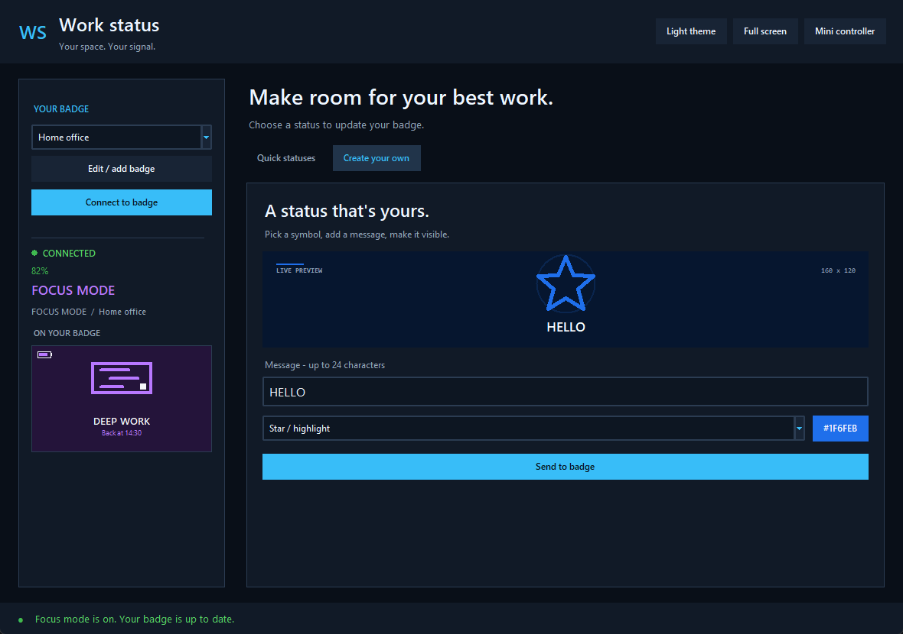

# Work Status Badge Controller

This folder contains the Windows controller for the **Work Status** badge app.
It uses only Python's standard library.

## First-time setup

1. Copy this entire `laptop` folder from the badge drive to your laptop.
2. Start **Work Status** from the badge's app menu.
3. Press **C** on the badge to reveal its address, such as
   `192.168.1.42:8080`, for eight seconds.
4. Double-click `Work Status.pyw` to launch without a terminal window.
   `run_work_status.bat` remains available for troubleshooting.
5. Enter a profile name and the address shown on the badge, then select
   **Save Badge** and **Connect**.
6. Confirm that the same six-digit code appears on the laptop and badge, then
   press **UP** on the badge. Pairing expires after 30 seconds.

The controller remembers multiple named badges in `badge_profiles.json` beside
the Python script, so copying the `laptop` folder also copies its profiles.
Select **New Badge**, enter a unique name and address, then select **Save
Badge**. Saving a new name keeps all existing badges. Use the dropdown to
switch between every saved badge, and **Show IP**/**Hide IP** to control
whether the selected address is visible. **Forget** removes only the selected
profile. Older profiles stored in
`%USERPROFILE%\.work_status_badge.json` are imported automatically when the
local profile file is absent. For the most reliable setup, reserve each badge's
IP address in your router's DHCP settings.

Each laptop installation also has a random device identity and a separate
per-badge authentication key in
`%USERPROFILE%\.work_status_badge_device.json`. Do not share that file: a copy
has the same authority as the paired laptop. The badge remembers up to eight
approved controllers across restarts.

The redesigned dashboard keeps the badge connection in a dedicated sidebar
and your status controls in the main workspace. The sidebar shows battery,
connection state, the active status and a preview of the last confirmed update.
After connecting, setup fields fold away. Select **Edit / add badge** to manage
profiles again.

Use **Quick statuses** for the six presets, or **Create your own** for the custom
editor. These are separate views so neither is squeezed into a narrow column.
The selected preset gets an accent border. Connection feedback stays visible
along the bottom of the window.

Select **Dark theme** / **Light theme** to switch appearance; your selection and
drafts are preserved. **Full screen** or **F11** expands the workspace, and
**Escape** returns to the window. **Mini controller** (or **Ctrl+Shift+W**) opens
the always-on-top controller; **Open Dashboard** restores the full window.

## Use

Enter an optional short note, then press **Available**, **In a meeting**,
**Focus mode**, **Away**, **Lunch break**, or **Offline**. Lunch displays an animated curry
bowl. The badge changes after it confirms the update. Offline is a display status; it keeps Wi-Fi available. Button A on the badge cycles through the
six presets and the last custom status, clearing the note when a preset is
selected. A bright border
flashes briefly when a remote update arrives; the status screen no longer has
a permanent white border.

Use **Create your own** to build a custom status. Choose a vector symbol (star,
heart, check, alert, coffee, door, code or bolt), pick a colour, enter up to 24
characters, review the badge-accurate live preview, and select **Send to badge**. The preview uses the same darkened background treatment and
symbol geometry as the badge, with no dependency on laptop emoji fonts. Custom
settings are saved in `badge_profiles.json` and restored the next time the
controller opens.

The badge uses the full screen for the current symbol and text:

- Press **A** to cycle through the preset statuses and last custom design.
- Press **B twice quickly** to enter Mona-OS hardware sleep. The display,
  lighting and Wi-Fi turn off, so remote updates are unavailable while asleep.
  Press RESET to wake reliably.
- Press **C** to show the temporary network-address screen.

Both devices must be on the same local Wi-Fi network.

## Secure pairing

Pairing uses an ephemeral X25519 key exchange. The matching six-digit code
detects key substitution, and the badge stores the resulting device key only
after its physical **UP** button is pressed. The key itself is never sent over
Wi-Fi.

Every later request uses a fresh one-time challenge and HMAC-SHA256 signature,
and the badge signs its response in return. Unknown devices, forged responses,
altered commands, and replayed requests are rejected. To reject a pending
request, press **DOWN**. To erase every remembered controller, press **C** and
then **DOWN** while the address screen is visible. Each controller must then
pair again.

The status payload still travels over local HTTP, so authentication does not
hide notes from a passive network observer. Continue to use WPA2/WPA3 on a
trusted LAN; confidentiality would additionally require TLS.

## HTTP API

The badge listens on port `8080` while the Work Status app is open. Status
requests require `X-Work-Device`, `X-Work-Nonce`, and `X-Work-Signature`
headers. The supported controller obtains the nonce from `/api/challenge` and
calculates the HMAC automatically:

```text
GET  /api/challenge?device_id=<paired-device-id>
GET  /api/status
POST /api/status

{"status":"meeting","note":"Back at 3pm"}
```

Valid preset status values are `available`, `meeting`, `focus`, `away`,
`lunch`, and `sleep`. Notes are limited to 24 printable characters.

Custom requests use:

```json
{
  "status": "custom",
  "custom_text": "LUNCH TIME",
  "custom_symbol": "coffee",
  "custom_color": "#F0883E"
}
```

## Troubleshooting

- **Cannot reach badge:** confirm the Work Status app is open and use the exact
  address revealed by pressing C.
- **WiFi: missing config:** set `WIFI_SSID` and `WIFI_PASSWORD` in the badge's
  root `secrets.py`.
- **Address changed:** reconnect using the new address shown on the badge.
- Some guest Wi-Fi networks block device-to-device traffic. Use the main home
  network or disable client isolation.

The badge has no onboard speaker or buzzer, so it cannot produce an audible
notification without extra hardware. A small active buzzer can be added using
the exposed GPIO pads; the built-in app uses a visual flash instead.

## UI behaviour

Connection controls lock while a request is running, so a response cannot be
shown against a different badge. Theme changes preserve draft text. Battery
polling starts only after a successful connection.

Select **Quick statuses** to leave the custom editor. On shorter displays,
its preview becomes a compact message strip to keep the Send button accessible.
The sidebar preview remains visible after connecting, when setup fields fold away.

The badge shows connection state separately from the note. Long text is fitted
to the screen, and presets without notes show button hints. Press C again to
close the address screen early. **Offline** does not power the badge off;
double-press B for hardware sleep.

Run regression checks with `python -m unittest discover -s laptop/tests`.
The desktop layout checks require a working Tk installation and desktop session.



