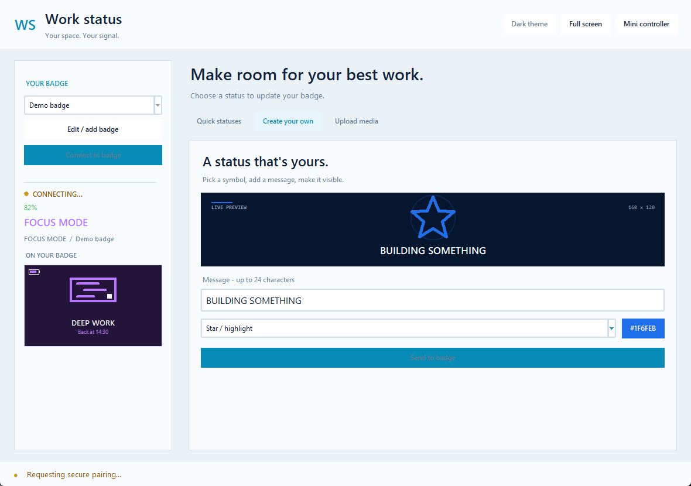
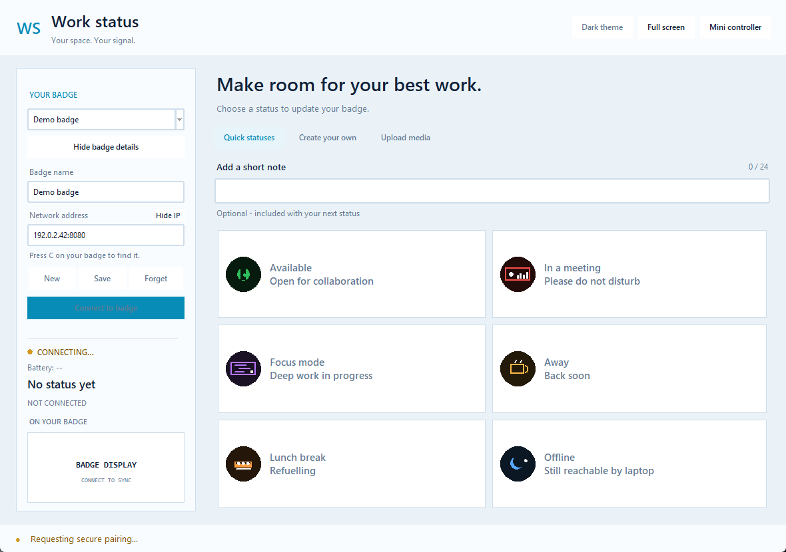
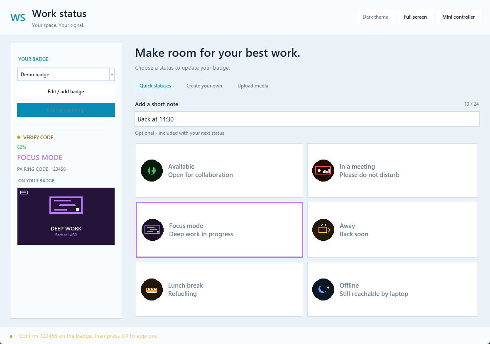
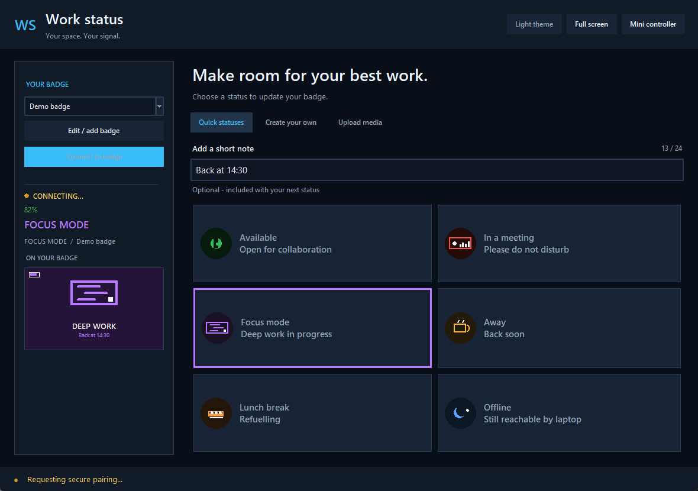
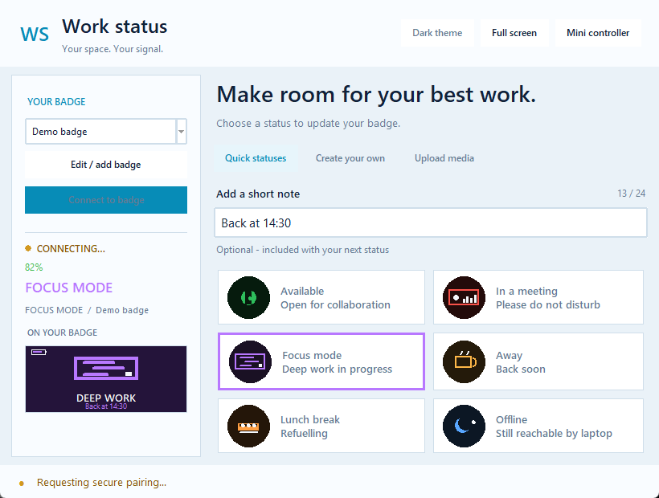
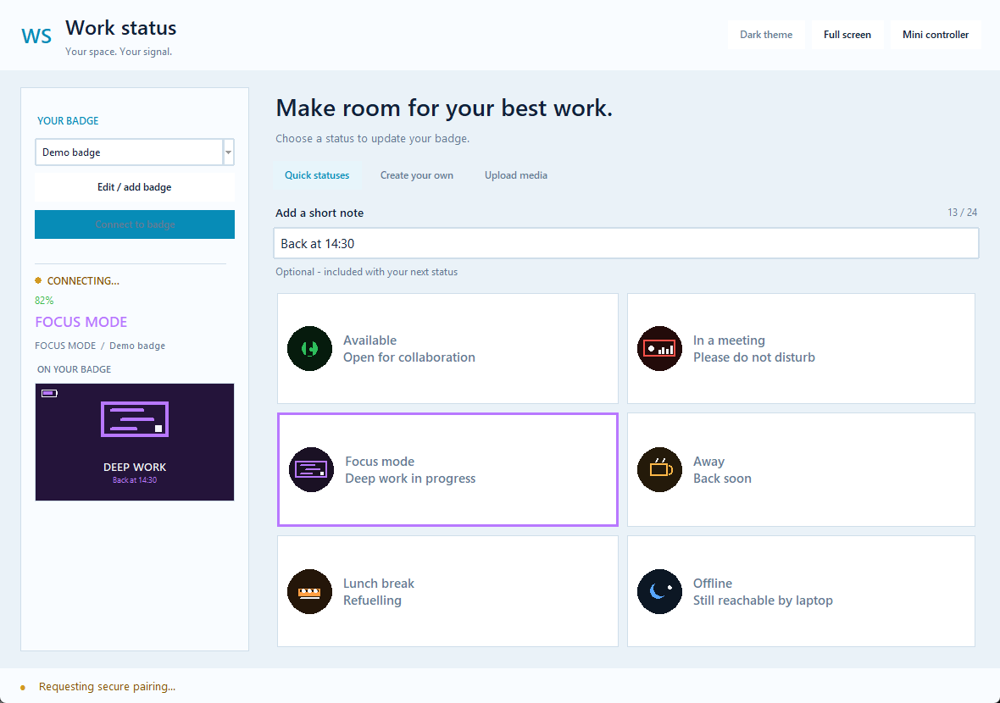
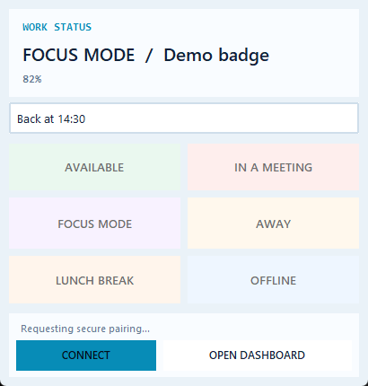
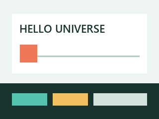

# Work Status Badge Controller

This folder contains the Windows controller for the **Work Status** badge app.
Standard status controls use only Python's standard library. Media editing
requires Pillow; importing a frame from video also requires ImageIO and its
FFmpeg backend (`python -m pip install Pillow imageio imageio-ffmpeg`).

## First-time setup

1. Download or clone the repository onto your laptop. Use Python 3.11+ with Tkinter.
2. Start **Work Status** from the badge's app menu.
3. Press **C** on the badge to reveal its address, such as
   `192.168.1.42:8080`, for eight seconds.
4. Double-click `Work Status.pyw` to launch without a terminal window.
   `run_work_status.bat` remains available for troubleshooting.
   If media packages are missing, the GUI offers to install them into the
   exact Python environment used to launch Work Status.
5. Enter a profile name and the address shown on the badge, then select
   **Save Badge** and **Connect**.
6. Confirm that the same six-digit code appears on the laptop and badge, then
   press **UP** on the badge. Pairing expires after 30 seconds.

The controller remembers multiple named badges in `badge_profiles.json` beside
the Python script, so copying the `laptop` folder also copies its profiles.
Select **New Badge**, enter a unique name and address, then select **Save
Badge**. Saving a new name keeps all existing badges. Use the dropdown to
switch between every saved badge, and **Show IP**/**Hide IP** to control
whether the selected address is visible. **Forget** removes only the selected
profile. Older profiles stored in
`%USERPROFILE%\.work_status_badge.json` are imported automatically when the
local profile file is absent. For the most reliable setup, reserve each badge's
IP address in your router's DHCP settings.

Each laptop installation also has a random device identity and a separate
per-badge authentication key in
`%USERPROFILE%\.work_status_badge_device.json`. Do not share that file: a copy
has the same authority as the paired laptop. The badge remembers up to eight
approved controllers across restarts.

The redesigned dashboard keeps the badge connection in a dedicated sidebar
and your status controls in the main workspace. The sidebar shows battery,
connection state, the active status and a preview of the last confirmed update.
After connecting, setup fields fold away. Select **Edit / add badge** to manage
profiles again.

Use **Quick statuses** for the six presets, **Create your own** for a custom
sign, or **Upload media** for images and animated GIFs. These are separate views
so neither is squeezed into a narrow column.
The selected preset gets an accent border. Connection feedback stays visible
along the bottom of the window.

Select **Dark theme** / **Light theme** to switch appearance; your selection and
drafts are preserved. **Full screen** or **F11** expands the workspace, and
**Escape** returns to the window. **Mini controller** (or **Ctrl+Shift+W**) opens
the always-on-top controller; **Open Dashboard** restores the full window.

## Use

Enter an optional short note, then press **Available**, **In a meeting**,
**Focus mode**, **Away**, **Lunch break**, or **Offline**. Lunch displays an animated curry
bowl. The badge changes after it confirms the update. Offline is a display status; it keeps Wi-Fi available. Button A on the badge cycles through the
six presets and the last custom status, clearing the note when a preset is
selected. A bright border
flashes briefly when a remote update arrives; the status screen no longer has
a permanent white border.

Use **Create your own** to build a custom status. Choose a vector symbol (star,
heart, check, alert, coffee, door, code or bolt), pick a colour, enter up to 24
characters, review the badge-accurate live preview, and select **Send to badge**. The preview uses the same darkened background treatment and
symbol geometry as the badge, with no dependency on laptop emoji fonts. Custom
settings are saved in `badge_profiles.json` and restored the next time the
controller opens.

The badge uses the full screen for the current symbol and text:

- Press **A** to cycle through the preset statuses and last custom design.
- Press **B twice quickly** to enter Mona-OS hardware sleep. The display,
  lighting and Wi-Fi turn off, so remote updates are unavailable while asleep.
  Press RESET to wake reliably.
- Press **C** to show the temporary network-address screen.

Both devices must be on the same local Wi-Fi network.

## Photo frame in the Windows GUI

The updated `apps/work-status` badge application can show pictures without
exiting Work Status. To enable this feature, copy the **new** Work Status folder
onto your badge, restart it and open Work Status. The old badge app cannot
accept picture uploads even if you update only the laptop controller.

Install the optional media libraries in the same Python environment used by
the controller:

```powershell
python -m pip install Pillow imageio imageio-ffmpeg
```

On your home Wi-Fi, open the Windows dashboard, connect with your **existing**
paired badge identity, and select **Upload media**. Use the prominent **Select
image / GIF / video** button to choose local media. Animated GIFs move in the
preview and on the badge, retaining frame timing and repeat count. Videos
still use their first frame. Drag the live 4:3
preview to reposition the frame, adjust the zoom, then press **Upload to
badge**. A progress
message shows the authenticated chunk transfer. The laptop converts the image
to an 80×60, 8-bit paletted PNG. The badge scales the same 4:3 crop to its
160×120 screen. The decoded pixel buffer is only 4,800 bytes, compared with
76,800 bytes for a full-size true-colour image. The selected
picture is saved on the badge and remains available when Work Status is
reopened.

The output is limited to 256 colours and is scaled from 80×60, not a
full-resolution photograph. Cancelling the picker keeps the current draft.
An upload abandoned for 60 seconds is discarded without deleting saved media.

GIF uploads support up to 120 frames and 512 KiB after conversion. Every
frame uses the chosen crop and zoom. The badge stores the frames and loads
one at a time, so playback continues without the laptop or a Wi-Fi connection.
Very short frame delays are limited by the badge's decoding speed (minimum
requested delay: 20 ms). Selecting a status stops animation playback.

Update both the laptop files and `apps/work-status/__init__.py` on the badge,
then reopen both apps. Older badge handlers accept only 160×120 and cannot
decode photos within the available RAM. The controller checks for low-memory
photo support before transferring an image and asks for a badge app update
when needed. GIF playback requires the animation-capable badge app as well;
an older app is reported instead of silently showing just the first frame.
Re-pairing and a firmware reflash are not required.

Uploads use lossless PNG compression and negotiate the badge's chunk size.
Updated badges accept 1,536-byte chunks and service active transfers without
the normal 100 ms status-animation delay; older builds retain 768-byte chunks.
The fast transfer loop returns to normal idle timing after traffic stops.
Signed media responses include the next single-use security challenge, so
each chunk does not need a separate challenge request. Expired challenges
and dropped responses fall back to fetching a fresh one; older badge apps
continue to use the original challenge flow.
GIF frames are still decoded and checked before replacing the saved media.
Deleting optional apps frees storage, not decoder RAM. Keep the launcher/menu
and shared assets/fonts when removing apps.

To go back to an animated Work Status screen, click any preset or custom
status from the dashboard, or press **A** on the badge. Existing saved
controllers, profiles and pairing keys are kept; pictures are private to this
badge and are never sent to GitHub or a cloud service. The photo itself is
not encrypted by local HTTP, so use a trusted WPA2/WPA3 network.

Phone/browser uploads and video playback are not provided by this application.
The former standalone Photo Frame app is no longer distributed in this repo.

## Secure pairing

Pairing uses an ephemeral X25519 key exchange. The matching six-digit code
detects key substitution, and the badge stores the resulting device key only
after its physical **UP** button is pressed. The key itself is never sent over
Wi-Fi.

Every later request uses a fresh one-time challenge and HMAC-SHA256 signature,
and the badge signs its response in return. Unknown devices, forged responses,
altered commands, and replayed requests are rejected. To reject a pending
request, press **DOWN**. To erase every remembered controller, press **C** and
then **DOWN** while the address screen is visible. Each controller must then
pair again.

The status payload still travels over local HTTP, so authentication does not
hide notes from a passive network observer. Continue to use WPA2/WPA3 on a
trusted LAN; confidentiality would additionally require TLS.

## HTTP API

The badge listens on port `8080` while the Work Status app is open. Status
requests require `X-Work-Device`, `X-Work-Nonce`, and `X-Work-Signature`
headers. The supported controller obtains the nonce from `/api/challenge` and
calculates the HMAC automatically:

```text
GET  /api/challenge?device_id=<paired-device-id>
GET  /api/status
POST /api/status
GET  /api/frame
POST /api/frame/start
POST /api/frame/chunk?offset=<byte-offset>
POST /api/frame/finish

{"status":"meeting","note":"Back at 3pm"}
```

Valid preset status values are `available`, `meeting`, `focus`, `away`,
`lunch`, and `sleep`. Notes are limited to 24 printable characters.

Custom requests use:

```json
{
  "status": "custom",
  "custom_text": "LUNCH TIME",
  "custom_symbol": "coffee",
  "custom_color": "#F0883E"
}
```

## Troubleshooting

- **Cannot reach badge:** confirm the Work Status app is open and use the exact
  address revealed by pressing C.
- **WiFi: missing config:** set `WIFI_SSID` and `WIFI_PASSWORD` in the badge's
  root `secrets.py`.
- **Address changed:** reconnect using the new address shown on the badge.
- Some guest Wi-Fi networks block device-to-device traffic. Use the main home
  network or disable client isolation.

The badge has no onboard speaker or buzzer, so it cannot produce an audible
notification without extra hardware. A small active buzzer can be added using
the exposed GPIO pads; the built-in app uses a visual flash instead.

## UI behaviour

Connection controls lock while a request is running, so a response cannot be
shown against a different badge. Theme changes preserve draft text. Battery
polling starts only after a successful connection.
Background refreshes do not overwrite unsent notes or custom-design drafts.

Select **Quick statuses** to leave the custom editor. On shorter displays,
its preview becomes a compact message strip to keep the Send button accessible.
The sidebar preview remains visible after connecting, when setup fields fold away.

The badge shows connection state separately from the note. Long text is fitted
to the screen, and presets without notes show button hints. Press C again to
close the address screen early. **Offline** does not power the badge off;
double-press B for hardware sleep.

Run regression checks with `python -m unittest discover -s laptop/tests`.
The desktop layout checks require a working Tk installation and desktop session. Photo editing tests additionally require Pillow.




## Workflow screenshots

All desktop captures use the real Tk UI with fictional documentation addresses
and an example pairing code. Badge illustrations use substitute desktop fonts;
they are not hardware photographs. The demo animation is original generated
artwork. See [the verification matrix](../docs/RELEASE-READINESS.md#feature-coverage)
for tests and hardware coverage.

| Profile setup | Pairing |
| --- | --- |
|  |  |

| Dark theme | Compact layout |
| --- | --- |
|  |  |

| Media editor | Connection error |
| --- | --- |
|  |  |





## Protocol details and limits

Use `BadgeClient` in [work_status_controller.py](work_status_controller.py) as
the reference client. Signatures cover method, API path, nonce, and the body
hash; query parameters are not signed. Chunk offsets and the complete-file
checksum are checked separately. Success responses are signed. Pairing/bootstrap
endpoints are unauthenticated; this is a trusted-LAN service, not an Internet API.

Start metadata contains `size`, `sha256`, and `format` (`png` or `wsa1`). The
start response advertises chunk size. `wsa1` consists of `WSA1`, big-endian
16-bit frame count and total play count (0 means infinite), followed by each
frame's 16-bit delay in milliseconds, 32-bit PNG length, and PNG bytes. See
[photo_tools.py](photo_tools.py) and the [badge implementation](../apps/work-status/__init__.py).

The preview loops while editing; the badge follows the GIF's actual repeat
count, including finite animations. Upload limits apply after conversion, not
to the original file size. Leaving photo mode stops playback but retains saved
media. Forgetting a profile does not revoke its pairing key; clear trust on the
badge to revoke controllers. See [SECURITY.md](../SECURITY.md).
